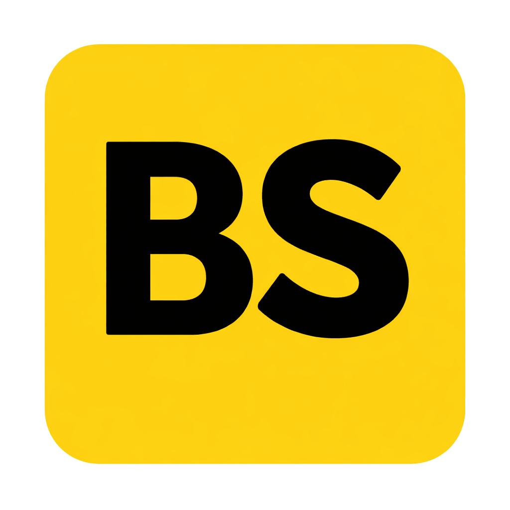

<div align="center">
  
  <h1>BareScript</h1>
  <p><strong>Lightweight Userscript Manager for Chrome</strong></p>
</div>

A minimal alternative to Tampermonkey for running custom scripts on any website.

## Features

- Run custom JavaScript on any website using `@match` patterns
- Simple dashboard for managing scripts
- Per-script enable/disable toggle
- Familiar userscript metadata format
- **Libraries** - Create reusable code modules that scripts can import

## Building

```bash
# Install dependencies
npm install

# Build for production
npm run build
```

The built extension will be in the `dist/` directory.

## Testing in Chrome

1. Build the extension (see above)
2. Open Chrome and navigate to `chrome://extensions/`
3. Enable **Developer mode** (toggle in top-right corner)
4. Click **Load unpacked**
5. Select the `dist/` folder from this project
6. The extension icon should appear in your toolbar

## Creating a Userscript

Click the extension icon and open the Dashboard. Create a new script with the following format:

```javascript
// ==BareScript==
// @name        My Script
// @match       https://example.com/*
// @run-at      document-end
// ==/BareScript==

console.log('Hello from userscript!');
```

### Supported Directives

| Directive | Description | Example |
|-----------|-------------|---------|
| `@name` | Script name displayed in dashboard | `@name My Script` |
| `@type` | Script type: `script` (default) or `library` | `@type library` |
| `@match` | URL pattern where the script runs (can have multiple) | `@match https://example.com/*` |
| `@run-at` | When to inject the script | `@run-at document-end` |

**`@run-at` values:**
- `document-end` (default) - Run after page is fully loaded
- `document-start` - Run as soon as `document.body` is available (earliest possible)

### Supported `@match` Patterns

- `*://*/*` - All HTTP/HTTPS URLs
- `https://example.com/*` - Specific domain
- `https://*.example.com/*` - Domain with subdomain wildcard

## Libraries

Libraries let you share code between scripts. Create reusable utilities once and import them in any script.

### Creating a Library

Click **+ New Library** in the Dashboard:

```javascript
// ==BareScript==
// @name        my-utils
// @type        library
// ==/BareScript==

export default {
  hide(el) {
    if (el) el.style.display = 'none';
  },
  show(el) {
    if (el) el.style.display = '';
  }
};
```

### Using Libraries in Scripts

Import with ES module syntax:

```javascript
// ==BareScript==
// @name        My Script
// @match       https://example.com/*
// ==/BareScript==

// Default import
import utils from 'my-utils';
utils.hide(document.querySelector('.ad'));

// Or named imports
import { hide, show } from 'my-utils';
hide(document.querySelector('.banner'));
```

Libraries are inlined at injection time - no runtime loading or global pollution.

## Development

```bash
# Run in development mode with hot reload
npm run dev
```

## Permissions

BareScript requires the following Chrome extension permissions:

| Permission | Why It's Needed |
|------------|-----------------|
| `storage` | Save your userscripts and settings locally |
| `scripting` | Inject userscripts into web pages |
| `tabs` | Detect page navigation to trigger script injection |
| `webNavigation` | Detect SPA navigation (pushState/replaceState) to re-run scripts |
| `host_permissions: *://*/*` | Allow scripts to run on any HTTP/HTTPS URL matching your `@match` patterns |

**Privacy note:** BareScript does not collect any data. All scripts and settings are stored locally on your device. See our [Privacy Policy](https://github.com/flamenkito/barescript/blob/master/PRIVACY.md) for details.

## Website

Static site for landing page and privacy policy is in `docs/`.

```bash
# Preview locally
npx serve docs

# Or with specific port
npx serve docs -p 3000
```

## Tech Stack

- TypeScript
- Preact
- Vite
- Chrome Extension Manifest V3
